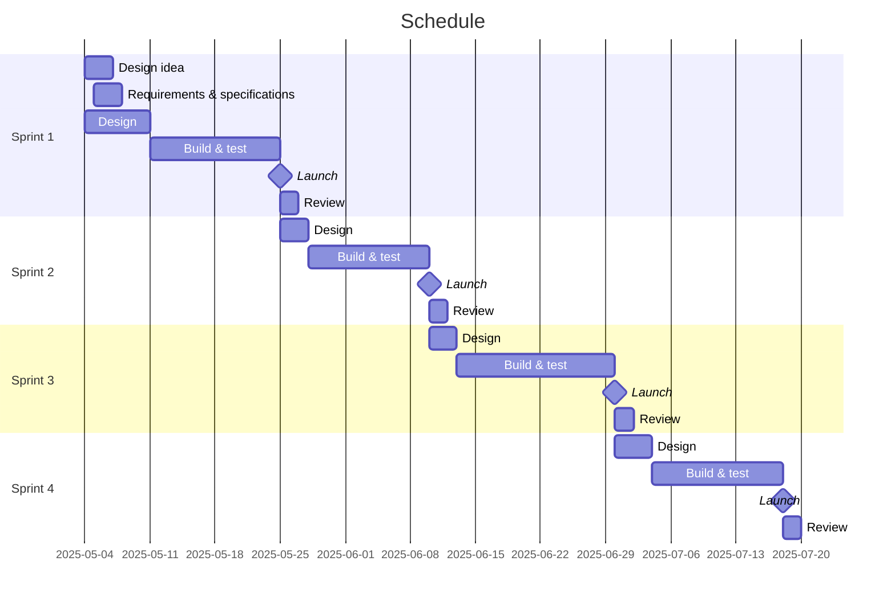

# Mori no komichi (森の小道); Forest path
A todo app with many, many features.

# Sprint 1
## Requirements outline
### Functional requirements
1. The user must be able to view, edit and delete tasks and subtasks that the system will store
2. The user must be able to view statistics on the time they spent studying.
3. The system must accept keyboard and mouse input to navigate the entire app.
4. The system must transparently monitor the user's activity to determine if they are on task when they have chosen to study.
### Non-functional requirements
1. The program must launch with a negligable delay, causing zero friction stopping the user from starting working on tasks.
2. The system needs to be fully functional all the time; including not requiring any internet connection and ensuring when an exception occurs, everything is smoothly processed for little user interruption.
3. The system must have clear labels and prompts and an onboarding page to be as accessable to users as possible.
## Specifications outline
### Functional specifications
1. The user must be able to create, edit and delete tasks and subtasks that the system keeps track of.
2. The user must be able to view detailed graphs of their study patterns.
3. The user must be able to study on a task and get user-defined rewards for the amount of time they spent on their tasks.
4. The user must be able to navigate all menues using their mouse and input values with their keyboard.
5. The user must be able to control an in-app character in world-building segments using their keyboard, and using their keyboard and mouse must be able to change the decorations in the world.
6. The system must be able to track what programs the user has open when studying and categorise them as productive or unproductive for an overall score.
7. The system will be implemented as a desktop app.
8. The program must have robust exception handling; and for errors that can occur, such as file not found and bad inputs (e.g. text instead of number), the program should prevent the problem from being as much of an inconvenience as possible; gracefully handling every issue, either fixing the problem or smoothly alerting the user and resuming or restarting the app's progress for a clean user experience.
### Non-functional specifications
1. The system must always launch with a delay or less than 0.5 seconds, and from startup there should be less than half a second of delay. This ensures user engagement and ease of use.
2. The user interface must follow a consistant and easily understandable interaction pattern. The menues must have a hierachial order, so the back button goes to the last page; helping the users not get lost.
3. All user interface elements must be clearly labelled
4. An onboarding process must explain how to use every feature of the app, ensuring all users will understand how to use the app. Additionally, the onboarding must be avaliable at any time if a user forgets.
## Use case diagram
## Storyboards
The storyboard is very large, so please view it online [here](https://excalidraw.com/#json=0pviVfWcTNLK0z1RRgB37,hJraR8767Ax1RVhMA-3DlQ)
## Data flow diagrams
### Level 0

### Level 1

## Gantt chart

(View [here](https://mermaid.live/view#pako:eNqllE1zmzAQhv-KZg89gUcSBgmOrSen-NKc2uGigQ3WFIQrRNLW4_9e4U-SOMlg73BYLfO8y74adgNFWyJkUCnjXG6ID6ddjeShWGHZ17ivlcrhXWsb5cgPH-FyGS4W-1cdFk63hjysrTaOsH11iAV2ujJEl6jI28g45XFI_TMPyCkXZ_w7_u61xQaN68gX0q2x0I-6UEO3boTHI1y-6f5OXOzORh__tdd16ds67NwHOGNnnMdn_F71pli9273RtddtDQZkhHupZjz_k8bnTwfgo_m5uHgnfLIrL0TlZFe4POJJyOgNrgz4Fa4csGPOL7oSTXTllWg00ZUBOePRba5E17kSnQYQIb3synyyKy9E5xNdEaMfUIRM3uDKgF_hygE75NzfCwRQWV1C5myPATTo995whM0gnYNb-aWUQ-bTUtlfOeRm65m1Mj_btjlitu2rFWSPqu78qV8PK3ShVWVVc6paNCXab21vHGSMx2ynAtkG_kAm6CyNRBzAX8h4ksxYyhKWShHReZJuA_i3a0ZnUsTUB6OplELGaQBYatfa5X6z7xb89j9Dk1ft))

# Sprint 2
# Sprint 3
# Sprint 4
