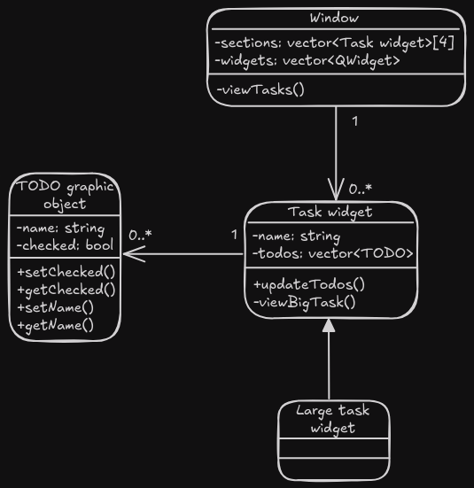

# Mori no komichi (森の小道); Forest path
A simple yet effective todo app with a cute aesthetic. Named this way as this app will help you find your 'path' to success in a 'forest' of tasks!

Please note that the excalidraw diagrams included have been rendered for dark mode. Light mode is also supported, but requires you to open the excalidraw file to view it yourself. This can also be helpful for diagrams that are quite large.

# Sprint 1
In this sprint, the goal is to define the requirements and create the UI. The app at this stage will have all the layout set out, with transitional and interactive elements completed. Additionally, the UI will look finished; as this sprint is entirely focussed on the UI, it should look like the final product by the end.
## Requirements outline
### Functional requirements
1. The user must be able to manage a list of tasks and their subtasks.
2. The system must robustly store and retrieve the tasks and subtasks automatically.
3. The system must handle keyboard and mouse inputs for navigating the app and interacting with the UI elements.
4. The system must have graceful and robust error handling.
5. The app must not use the internet.
### Non-functional requirements
1. The program must launch with a negligible delay and respond to user interaction quickly.
3. The system must have clear labels and prompts to maximise accessibility.
4. The user interface must follow a consistent and easily understandable interaction pattern so users will not get lost.
## Specifications outline
### Functional specifications
1. The user must be able to create, rename and delete tasks and subtasks. Additionally, the user must be able to toggle the checked state of subtasks.
2. The system must store and retrieve the tasks and subtasks automatically from an external file, handling all related issues robustly such as starting when the file or folder does not exist. It must additionally save every time the user makes a change, ensuring constant sync between what the user sees and the save file's contents.
3. The user must be able to navigate all menus using their mouse and input values with their keyboard. Additionally, the user must be able to toggle the checked state of subtasks with their mouse.
4. The program must have robust exception handling; ensuring all errors that could happen are tested against and fixed or handled appropriately.
5. The app must not connect to the internet.
### Non-functional specifications
1. The system must always launch or respond to user actions with a delay of less than half a second.
3. All user interface elements must be clearly labelled, and all hard to understand interactions must be listed in a position the user can easily access such as a help screen or help dialog.
4. The user interface must follow a consistent and easily understandable interaction pattern. The menus must have a hierarchical order, so the back button goes to the last page; ensuring users do not get lost.

## Use case
```yaml
Actor: User
Preconditions: N/A
Main Flow:
1. System retrieves tasks from file (if exists) and displays them
2. User adds a new task, system updates storage and displays tasks including new task
3. User clicks on task, system shows large view of task
4. User edits task name, system updates storage and displays task with updated name
5. User adds a new subtask, system updates storage and displays updated task with new subtask
6. User edits sub-task name, system updates storage and displays task with updated subtask name
7. User deletes sub-task, system updates storage and displays updated task without the recently deleted sub-task
8. User deletes task, system updates storage and displays tasks without the recently deleted task
Postconditions: Updated tasks and subtasks have been stored
```
### Diagram

## Storyboard

## Data flow diagrams
### Level 0

### Level 1

## Gantt chart

(You can also view it [here](https://mermaid.live/view#pako:eNqllD1PwzAQhv-KdQNTWsVJ84FHqJjoQidQFis-UovELo7DV9X_jtNSYqktKHDKcHb8vGe_Tm4DpRYIDCqurC0UcWGlrZEsyxWKrsb9nOAWb7RpuCX3LiaLxWQ-379qsbRSK7JcG6ksofvZPubYykoRKZCT42BRGCWT0D2zgHzn2YDf4XMnDTaobEsuSLvGUj7KkvfVWg9PPDw_qn4mTuLU2_xVJ2vhylps7Q84pQMehwN-yztVrs5Wb2TtdLXCgHi4k2r8879IfP31ADvskNOTdxKNdmUQTSfhWFd6ZMDpf1zp8T-48oUd8tOuxJ4rkleGN-0Y0eik6Gyk1an3BQ2iI6ymkYen_7M6_ZvVqbeDHAKojBTArOkwgAZd0-iHsOmFC7Ar90cXwFwquHkqoFBbx6y5etC6OWBGd9UK2COvWzfq1n3_-bqk7yWoBJpr3SkLLNkpANvAG7AsnF7GmZt6Bxbl2TSZXdI4jsMwy2mUbAP42FUKp3m_CIW02iz2bXDXDbefW_gtmA))

Time split reasoning:
- Most of the time will be spent in sprints 1 and 2;
   - In sprint 1, we will create the entire app for all but functionality; the basics of the UI (with some fancy parts to ensure the design theme chosen is OK).
   - In sprint 2, we will make the app function by adding all the code that wasn't created in sprint 1, integrating it with the UI already created.
- Sprint 3 is just diagrams
- Sprint 4 is finishing touches - not much is to be done compared to the other sprints, the bulk of the app is already complete

## Final evaluation
The system currently achieves most of the requirements; but as the functionality will be implemented in sprint 2, there are some requirements not yet completed.

The system can be navigated and used with the keyboard and mouse; the main area is pannable (with multiple controls for doing so), scrollable and zoomable - using the keyboard like most other apps do. This allows for users to easily adapt to the app. Additionally, the user can view, rename and delete tasks and subtasks (and toggle the subtasks); but the system doesn't store them yet or keep track of changes. This will be implemented in sprint 2. The system hasn't been thoroughly bug-checked, but hasn't run into any issues yet through my basic usage while developing. Additionally, the program runs without startup delay - achieving the set-out times, and does not have any internet-requiring aspects. The menus are all overlays; meaning that the entire system is in a hierarchical order; going back a page means removing the top-level overlay; although, there are only 2 overlays and they are separate. Lastly, the system does not yet have clear UI labels for describing what each element does, which is one of the requirements. This is due to running out of time and needing to complete the project faster in order to have it done on time, as currently I'm behind on the Gantt chart.

In relation to the use case, currently the user cannot create or remove tasks or subtasks, but can edit existing ones. Even so, the changes are not stored. This means that not much of the use case is currently completed. This is to be expected though, as the focus of sprint 1 is to create the UI, not the functionality - that will be the focus of sprint 2.

The program handles io as planned; allowing for editing task names and subtask labels, and for checking and unchecking subtasks. The only area of improvement is a small bug with QT in inputting a name for the subtasks where the space does not work. I will fix this in a future sprint.

My code is mostly readable, with comments and docstrings explaining hard to understand concepts in the code. It uses classes to store different widgets and elements in different classes to further improve the structure, and additionally most files have only one class in them. The files that do not either have one-off slightly modified base QT classes to modify its behaviour (these classes are always small, so do not impact the file's readability) or contain no classes and just helper functions that are used in other areas of the code (reused code creating better maintainability. Additionally, similar functions are grouped together; so developers can view all important functions for a specific task, e.g. drawing, in the same file). The naming conventions used are mostly CamelCase, and usually contain small descriptions that are mostly self-explanatory. This could be improved, but it's mostly readable by others through simple usage analysis if not documented already. I will improve this in a later sprint.

For the next stage of development, the requirements and specifications should be completely satisfied and the use case able to be realised; as the next sprint will focus on adding functionality to the UI. Additionally, the code quality will be improved to allow for better readability through ensuring consistency and adding docstrings and more comments to better explain everything.
# Sprint 2
In this sprint, we will make the app functional by implementing functionality to the current UI skeleton.
## Procedural structure chart

## Pseudocode and flow charts
```js
BEGIN
   tasks = GetTasks()
   SetupView(tasks)
   WHILE true
       IF window was closed THEN
           BREAK
       ENDIF
       clicked = GetClickedTask()
       IF clicked THEN
           LaunchBigViewOverlay(clicked)
       ENDIF
       INPUT events
       HandleEvents(events)
   ENDWHILE
END
BEGIN GetTasks()
   location = GetConfigFileLocation()
   IF PathExists(location) THEN
       fileContents = GetContents(location)
       RETURN fileContents
   ELSE
       RETURN []
   ENDIF
END GetTasks()
BEGIN SetupView(tasks)
   FOR i = 0 TO length(tasks)
       AddTaskWidget(tasks[i])
   NEXT i
END SetupView(tasks)
```

## Final evaluation
The program currently meets all requirements set out to at least some degree. The system allows users to view, rename and delete tasks and subtasks (and check subtasks) as before, but this time they are stored in an external file. Unfortunately, I did not do intensive bugfixing yet; but the app was built with robustness in mind; and crashes haven't occurred through my basic testing usage. Additionally, common points of error have been ironed out; for example, with file handling; if the file does not exist or an error occurred opening the file, it will not crash; and there are also no internet-dependent parts of the app.
With regards to the non-functional requirements, the system also exceeds in most. The program starts up and loads items with an almost invisible delay and has *some* clear labels for placeholder text in the text boxes, but could be improved with more labels and help popups. Although, when users first start up the app it will be filled with a sample onboarding tasks list to teach the users how to use the app; which helps, but not as much as clear labels. And lastly; as stated in sprint 1's final evaluation, the UI follows a hierarchical order through its use of overlays rather than separate pages.

The program now completes the use case; as every functional element defined in the use case can be executed in the system. Additionally, it handles input and output mostly well, although the bug stated in sprint 1's final evaluation did not get fixed yet. This will be fixed in a later sprint. Apart from that, all inputting and navigating works as expected.

The program's readability, structure and maintainability has not changed. The docstring and comment usage and naming conventions could be improved as they are currently not standardised.

Next sprint, I will improve docstrings and variable naming conventions to help readability and structure, in addition to fixing the space bug and adding clearer labels to the UI to help address the problems stopping the app from achieving all of its requirements and specifications.
# Sprint 3
In this sprint, we will design a UML class diagram. Additionally, we will improve the variable names and add consistent docstrings to the entire codebase to make it more maintainable for the future. And lastly, we will fix small bugs to improve the user experience.
## UML class diagram

## Final evaluation
After this sprint's clean-up, the codebase is much neater and consistent; with good comment and docstring usage consistently present in every file. Additionally, all variables and functions now follow a consistent naming convention using CamelCase, and some large files have been broken into smaller files for simplicity.
So all in all, currently the codebase is very easily readable and maintainable due to the well-documented functions and many comments throughout the files.

In the next stage of development, the last bugs will be fixed and features enhanced; completing all the requirements and specifications, whilst maintaining the readability of the codebase.
# Sprint 4
In this sprint, we will add final touches and finish the program, ensuring it meets the requirements.
## Potential enhancements
### Delete button for tasks
Currently, to delete a task users must backspace the entire name. The downfalls with this method are the abruptness of the deletion and the accidental deletion when a user wants to edit the name. So, adding a delete button instead for the tasks will help ensure deleting tasks is more purposeful instead of accidental and help users remember how to delete tasks in the first place.

To accomplish this, all that is needed is to modify the task updation scripts to delete the task removal and move it to the onclick of a new button.
### Fix the new task button layout
Currently, the new task button is in an awkward position, not exactly in the corner.

To fix it, the entire positioning system would need to be updated; but only the values of the positions would need to be modified. Positions will still be the same, but instead of being from 0-100% of the screen where setting it to 100% would end up offscreen, the positions would be 0-100% of the *available space* - `0-(screen width-item width)` being mapped to a range of `0-100`. This means 100% is flush with the edge of the screen no matter the widget, and also creates centring! Centring is done by `(screen width - item width)/2`; and with this new positioning, 50% would be `0.50*(screen width - item width)` - centred. This makes it much more convenient to position the widgets, as I don't have to calculate the centred positions manually.
### Coloured sections
Based on user feedback, the sections were not very distinguishable; and the buttons stating which numbered section to add a task to, while being in the correct quadrant, were unclear. To provide an easier experience, the sections should be coloured using different, easily distinguishable colours. I will only have to add new graphics objects into a new file and add their constructors to the existing tasks view, shouldn't require any more tweaking. These new graphics objects will use existing path creation functions to create their paths, and will then be filled with a colour.
### Limited zoom
The zooming would need to be limited to a max zoom of the entire area, and an appropriate minimum zoom. This would allow for users to not get lost scrolling in/out to infinity and panicking when they can't get back. Apart from these simple changes to the graphics canvas, nothing else is necessary to integrate this new feature.
### Fix todo label space issue
Currently, the todo label doesn't allow for an input of a single space. This bug would be easy to fix; just modifying some of the base classes (some of the graphics scene classes) to pass the space event directly like what I already have for another part of the UI.
### Improve UI design of some elements
Some elements are still the default, bland UI texture. This fix would make the app look more natural and have everything looking like it belongs.
Specifically, I will make some buttons to replace the 'add task to section' ones. These can be hard-coded svgs, as I already have the class for an svg button and there are only 4 - so it will be a simple drop-in replacement.
Additionally, the text boxes will need to be updated. I will add a textbox QWidget class which auto-generates a border using functions I already have and then add a textbox on top with an invisible border; and when focussed, the fancy border is highlighted. This will again be a simple drop-in replacement of the usages of the QLineEdit.
### Add a help menu
Currently, the onboarding is great; but if users have already deleted the onboarding tasks, they may forget how to do things that aren't obvious (e.g. delete a subtask). So, I will add another button in the top-right corner of the main screen for a 'help' page containing all this info. This is instead of adding extra labels as previously mentioned in final evaluations, as I believe labels will make things cluttered for no reason. This is because they would just be 'tips' on how to do things instead of helpful descriptions as pretty much everything in the app is already self-explanatory. So, only a help page is needed.
The help menu will consist of a big task widget modified to be not editable. This will be easy to implement; not changing anything, just making a new big task widget and modifying its features externally.
Additionally, the help menu will have the file path of the save file so users can easily locate it to find it easily to back it up or export to another device. This will be created with new svg buttons and will not be modifying anything, only adding.
### Add the ability to change a task's section
Currently, once a user creates a task it's stuck in that section. So, I will add some buttons to change the task's section. These could be the svg buttons that say 'add to xxx section' in a compact (not spread out like the new task overlay) grid in the bottom left corner of the task display, with their own callbacks. This would be added to the task overlay function without changing anything else. The widget's current section button will just be hidden; so when it changes the hidden and shown buttons just toggle visibility.
### Re-order tasks
Currently the tasks are stuck in the order the user creates them in. I will instead make a text box for inputting a number which is the task's priority; the higher the priority, the higher on the list it will be. I will have to create the number input box (an input box from the new UI update previous, just with a handler to only accept number inputs), a callback for it to change the task priority on input which includes a sorting function and lastly saving the priorities to the file; all of which also wouldn't change anything existing, just adding to what's already there.
## Updated charts
Since none of these changes affect the main structure or organisation of the code (being only focussed on minor UX upgrades and fixes), the structure chart and class diagram can be left untouched.
## Final evaluation
The app excels at the requirements and specifications it was outlined to achieve; satisfying each one to a high standard.

The app is fully navigable with just the mouse and keyboard, and the users can view, edit and delete tasks and subtasks the system automatically stores; just the same as in sprint 1. Although this time, the app has gone through extensive bug testing to ensure the app is as robust as possible; ironing out all common bugs and even some bugs that would be harder to find. This satisfies all of the functional specifications.

The system additionally excels at all the non-functional requirements and specifications too. The app launches almost instantly, satisfying the less than half a second set out in specification 1 - thanks to it being coded in C++ QT and not having any weighty startup imports or calculations. Moreover, the app is fully functional all the time; with no external dependency requirement, including files (it handles files not being there) and internet. Not only that, but its UI is clean and easy to understand. The buttons are self-explanatory and the menus easy to follow; as they are a system of overlays - where it is obvious where the back button leads. Not only that, but the menus are only one level down; meaning there is no chance the user could ever get lost. Even so; I've recorded everything the user needs to know in onboarding tasks and a help menu for if they need to remember anything.
Furthermore, the UI may be slightly confusing in some areas (to delete subtasks, users must backspace the entire name) but this is helped with labels and placeholder text - and whatever the user can't remember/understand is all described in detail in the onboarding tasks and help menu to make this app easy to use. This fulfils all the non-functional requirements and specifications.

In addition to complying with every requirement and specification, the app fully accomplishes the use case identified in sprint 1 and every input and output is handled correctly.
Furthermore, the code quality is exceptional; with comments explaining everything and docstrings for almost every function. The naming conventions are consistent, and the structure is neat and easy to follow, leading to ease of maintainability.

This app is ready for release, requiring no more feature updates. All that's left for this app is maintaining it by tracking the github page for issues and fixing or implementing anything that a user finds or wants to improve.
# System evaluation
With regards to the requirements and specifications, the system excels. See sprint 4 final evaluation for more detail.

The time management and project management was well done. In the beginning I had a much larger application, but after a while I realised it was never going to be finished on time. The idea was still a todo app, but I removed everything that wasn't to do with the basic todo app idea and went from there. Luckily for me, I planned it so all I had was the basic todo app at that point; so not much changed. It was because of this I was able to finish on time.

The Gantt chart went through adjustment as I realised I needed more time on the first 2 sprints and would speed through the last sprint as I was setting everything up. Even with the adjustment, I still went far overtime on the first sprint; but since after that I had everything done, I sped through the other sprints finishing them before they were due.
Additionally, I procrastinated somewhat on the first sprint; sometimes going a week or so without working on the task. As the due date came closer, I worked harder and harder; which also helped the other sprints go by faster.
Furthermore, I am new to QT; which means that by the last sprints I knew more and could write code more quickly.

## OOP class features
Since this project was created for QT, and in C++, there is almost no way to have made this project correctly and without classes. All QT objects and widgets are classes; and to extend any functionality, developers need to create subclasses to those. All the OOP features must be used in this case to correctly use the QT library.

Inheritance is one of the biggest OOP class features used in QT. To extend any widget's functionality, developers must create a subclass and inherit the original class' behaviour. This means that every class I have that extends QT functionality (which is all of them) must use inheritance to keep the original methods from the QT class so they can be used as direct replacements in my program, just with my added functionality.

On top of that, through encapsulation these widgets are able to function correctly without programmer error. This is where internal functions and attributes are not allowed to be used by other code. Through this, my code is able to function with less error as it only uses the methods and attributes QT wants me to. Additionally, in my code I use encapsulation as this makes my code more robust in the same way. This is required in my classes as I pass around the classes to many different functions and other classes, meaning they require encapsulation to ensure the code ran is only the code I want to be ran; ensuring better error control.
Furthermore, In my code, my classes through their hidden internals are more reusable as the subclasses can only modify a subset of the internals (the 'protected') meaning that even with subclasses it still has hidden elements; creating increased robustness as before.

Likewise, through abstraction the widgets are able to unlock the potential of the encapsulation mentioned previously. Abstraction, where simple items are shown and complex internals are hidden, makes it easier to debug; as only the necessary amount of information is shown to other classes, meaning there's less code to debug. Additionally, through abstraction code duplication is avoided through duplicate complex functions being simplified; creating reusability.

Furthermore, polymorphism is another large part of the codebase and OOP in general. All my classes are slightly modified versions of the original (some more than others), meaning they have almost the same functionality but are just slightly differing from the parent QT classes. For example, in my code I have an input box class which overrides the QLineEdit class; but only overrides the draw function to have a different border. This proves how important polymorphism is; it enables programmers to modify classes and slightly extend them to do different things. And in my classes, this is used everywhere; almost all my classes override at least the draw function of their respective parent QT base class. This is called method overriding; where the parent class has some methods modified from the original; another big part of OOP, and widely used in my classes.
Method overloading is another part of OOP, but hasn't been necessary in this project. It is where code is modified so running the same function but with different parameters causes different outcomes; but it doesn't have any advantages apart from simplicity, and isn't necessary; which is why I don't have it. It's only required if there are many functions that do almost the same thing; but I don't have any scenario where this is a problem.

Another large part of OOP is the use of constructors and deconstructors. These create ease of use and reusability in code; as to set up a class with many different parts, developers may be required to run many functions; which is simplified by adding a constructor to do all this at creation. This is used in most of my classes, as most of them require setup or creating of cache or other things. Although, in two cases, I have functions to set up classes as they cannot be fully initialised within their constructors due to some QT constraints.
Additionally, deconstructors are used to ensure all necessary parts of an object are deleted or handled properly when the object is destroyed. This I use less because QT and C++ usually handle this for me, but I occasionally do use it for some objects, just not very much.

In summary, due to the nature of the project, the code was required to use OOP and its structures, but I not only used it for the requirement but also utilised its functionality to make my code cleaner, reusable, robust and easy to debug.


Each class I have had similar reasons for being designed; as each one extends the functionality of the base QT classes.
Each class uses inheritance to ensure reusability as described before and method overriding as that's unavoidable, but other classes were made for different reasons and therefore use different OOP properties.

Some classes were made to improve upon existing QT classes; those being the GraphicsViewCanvas, InputWidget and SvgBtnWidget classes. Each of these classes uses method overriding to modify only some of the base class' methods; with the GraphicsViewCanvas, it overrides the mouse and keyboard events to handle user interaction differently from the base class; in this case, adding zoom, pan and better scroll - as that is the purpose of that class. Although, it does not modify the draw function; unlike the other 2. The InputWidget's purpose is to do the same thing as the QLineEdit it subclasses, although drawing it with a different outline; meaning all it needs to override is the paint event. Lastly, the SvgBtnWidget is in the middle of both of these; it handles some mouse events through method overriding and also the paint event; so it can draw the button as a widget, and have it expand on hover.
All these classes use inheritance, encapsulation, abstraction and polymorphism that QT base classes have provided us so as to not repeat base code. For example, the SvgBtnWidget does not care about handling keyboard events; so it doesn't need to override that method from the base class unless later it did need to.

QT's abstracts the event loop, making the main Window class neat as all the events are handled internally.
Additionally, through polymorphism and method overriding it can replace the default functionality; in this class, the resizing event was overridden to update all the widgets when it gets resized, so the layout still is consistent even when resized.

Another class used was the TaskWidget class. This class used OOP like the Window class, except overriding the mouse, hover and paint events; the mouse and hover for the expanding effect on hover and the paint so I can customise what is painted.
The TaskWidget class and additionally the SectionBgWidget, TodoGraphicObject and OverlayWid classes all override the main QWidget or QGraphicsWidget class, but are required to override the paintEvent (or drawEvent) as the base classes do not draw anything. This polymorphism and inheritance allows for my own custom widgets whilst specifying only the required functionality; adding robustness and cleanliness to the codebase.
The Window class has similar functionality, but as it is a parent for widgets, the base QT class handles drawing the children for it.

Additionally, the BigTaskWidget is a subclass of the TaskWidget class. This means it performs the same, except I have only added one function for updating due to width.
The parent TaskWidget class was created specifically to ensure the BigTaskWidget is as easy to implement as possible. The difference between the two became simpler and simpler as the development went on due to the increased use of abstraction until it became as simple as 'update the width when the window is resized'. Due to the abstraction used in the base class, all that is required to do so is to modify the 'width' attribute and then run the update function.
This abstraction creates ease of use and higher reusability and cleanliness of the codebase. The code is not repeated; as all code that would be run twice was added to only the base class as a separate function, and this means the debugging will be focussed in one place, not across multiple classes; increasing robustness.

Lastly, there are some classes that have been modified for specific purposes and are less reusable. These are the TitleText, TodoLabel, MyValidator and BetterGroup classes. These classes are small, and only override one or two parent class methods each - but are crucial for the code as they provide key functionality specific for their use case.
These have been added to other files instead of being given their own as they are so small and so specific for their one use case that it is simpler to have everything in one place for readability.
With these classes, they perform specific functions that the original classes do not; for the TitleText class, it forces an update for the taskview as the sizing of the task may have changed from the new title, and also it always has a dashed line when interactable for ease of typing when it's empty or seeing trailing spacing. For the TodoLabel, it is only editable when you double click; and stops being editable when you focus off it. The BetterGroup only overrides the boundingRect function to fix a bug, but the MyValidator is the validator to ensure the text in the input box is a number, and that has been virtually rewritten to ensure it sticks to the max and min values set.
So with all these classes, they perform the same function as the original but with slight modifications. The use of inheritance and polymorphism is a large part of what makes doing this so easy and clean; as without classes, I would have had to rewrite all the base QT code. Additionally, abstraction helps ensure the functions are as clean as possible; without needing to handle complex internals, and instead using the easy-to-use method overriding to handle events.

So overall, the use of OOP class features was necessary, but I also implemented it myself and utilised it in all my classes to the fullest extent. I have utilised and implemented inheritance, encapsulation, abstraction and polymorphism in all my classes to ensure the readability, reusability, robustness and cleanliness of the codebase.

## Peer evaluation
### Riley
I thought Max's program was really good, and all the UI was well designed. The zoom could go out further to encompass the entire tasks at once, but apart from that it's a well designed app!
### Oliver
The software functions nicely, and the UI looks very nice. The only point of improvement would be to undo changes. But apart from that, Max did a good job with this app
