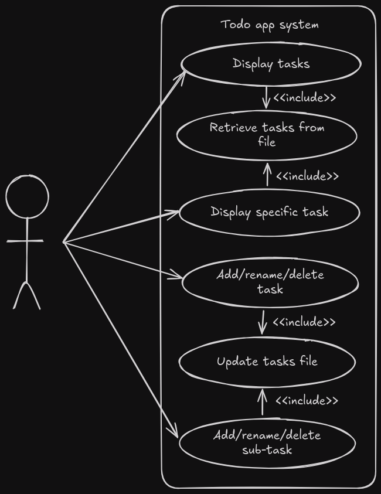
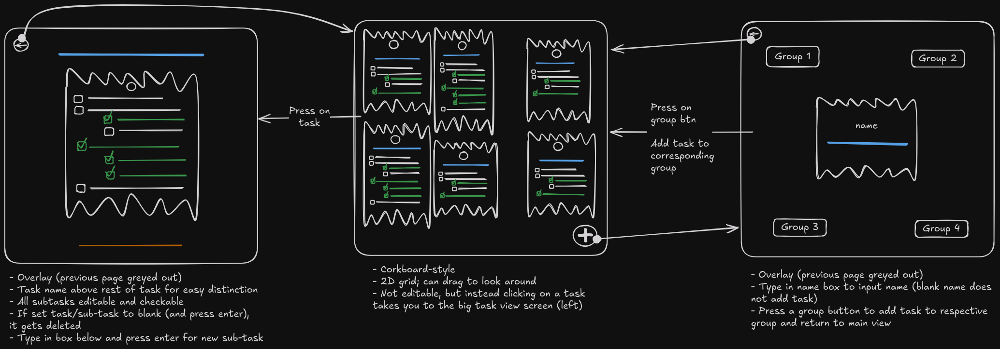
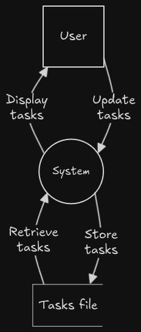

# Mori no komichi (森の小道); Forest path
A todo app with many, many features.

Please note that the excalidraw diagrams included have images rendered for dark mode. Light mode is also supported, but requires you to open the excalidraw file yourself. This can also be helpful for diagrams that are quite large.

# Sprint 1
In this sprint, the goal is to define the requirements and create the UI. The app at this stage will have all the layout set out, with transitional and interactive elements completed. Additionally, the UI will look polished; as this sprint is entirely focussed on the UI, it should look like the final product by the end.
## Requirements outline
### Functional requirements
1. The user must be able to view, edit and delete tasks and subtasks that the system will store.
2. The system must accept keyboard and mouse input to navigate the entire app.
### Non-functional requirements
1. The program must launch with a negligable delay, causing zero friction stopping the user from starting working on tasks.
2. The system needs to be fully functional all the time; including not requiring any internet connection and ensuring when an exception occurs, everything is smoothly processed for little user interruption.
3. The system must have clear labels and prompts to be as accessable to users as possible.
## Specifications outline
### Functional specifications
1. The user must be able to create, rename and delete tasks and subtasks that the system keeps track of and stores in an external file.
2. The user must be able to navigate all menues using their mouse and input values with their keyboard.
3. The program must have robust exception handling; and for errors that can occur, such as file not found and bad inputs (e.g. text instead of number), the program should prevent the problem from being as much of an inconvenience as possible; gracefully handling every issue, either fixing the problem or smoothly alerting the user and resuming or restarting the app's progress for a clean user experience.
### Non-functional specifications
1. The system must always launch with a delay or less than 0.5 seconds, and from startup there should be less than half a second of delay. This ensures user engagement and ease of use.
2. The user interface must follow a consistant and easily understandable interaction pattern. The menues must have a hierachial order, so the back button goes to the last page; helping the users not get lost.
3. All user interface elements must be clearly labelled
## Use case
```yaml
Actor: User
Preconditions: N/A
Main Flow:
1. System retrieves (if exists) and displays tasks
2. User adds a new task, system updates storage and displays tasks including new task
3. User clicks on task, system shows large view of task
4. User edits task name, system updates storage and updates storage and displays updated name
5. User adds subtasks, system updates storage and displays updated task with new subtask
6. User edits sub-task name, system updates storage and displays updated task with new subtask name
7. User deletes sub-task, system updates storage and displays updated task with deleted sub-task
8. User deletes task, system updates storage and displays tasks without deleted task
Postconditions: Updated tasks and subtasks have been stored
```
### Diagram

## Storyboards

## Data flow diagrams
### Level 0

### Level 1

## Gantt chart

(You can also view it [here](https://mermaid.live/view#pako:eNqllE1vozAQhv-KNYeeSISBAPFxN-ppc2lPXXGx8IRYAjs19u62Uf77GtIUq0lbpR1x8Nfzjv0azx5qLRAYNFxZWyniw0rbIrmvtyhci8cxwS3eatNxSx58zNbr2Wp1nOqxtlIrcr8zUllCj6NDrLCXjSJSICfnwZI4Wcxi_2UReW0XE36Hj04a7FDZntyQfoe13MiaD9n6AF8EeHmW_Z24mJ0Gm__hZCt8Wou9_QCndMLTeMJ_cafq7bvZO9l6Xa0wIgHupbrw_H8k_v30ACN2atOLd5Jc7cokms_ia10ZkAmn33FlwL_git_B8nwHb1xJA1ckbwzv-k9EaeAKTS6KZldanQd_0CR6hdU0CfD8e1bnX7J6xE5t_wAhgsZIAcwahxF06MvG0IX9IF2B3fo3XQHzTYEb7lpbQaUOHttx9Vvr7kQa7ZotsA1ve99zu6EIvdzU6xJUAs1P7ZQFthgVgO3hH7B0OU-ypQ9Ky8xH6mefgCV5Ol_mKV0UWV6URZkdIngec8bzsvBrUEirzfpYFcfiePgPbOgx1g))

Time split reasoning:
- Most of the time will be spent in sprints 1 and 2;
    - In sprint 1, we will create the entire app for all but functionality; the basics of the UI (with some fancy parts to ensure the design theme chosen is OK).
    - In sprint 2, we will make the app function by adding all the code that wasn't created in sprint 1, integrating it with the UI already created.
- Sprint 3 is just diagrams
- Sprint 4 is finishing touches - not much is to be done compared to the other sprints, the bulk of the app is already complete

## Final evaluation
The system currently achieves most of the requirements and specifications. The system can be navigated with the keyboard and mouse (specified in functional requirement and specification 2), and the user can view, edit and delete tasks and subtasks; but the system doesn't store them yet or keep track of changes (as required in functional requirement and specification 1). The system does not have error handling but doesn't require internet so can be used at any time (functional specification 3 and non-functional specification 2). The reason for not including error handling is there isn't a situation yet where error handling is required; as currently, the project doesn't have much apart from the UI. The program additionally runs as soon as possible, achieving the set-out times in non-functional requirement and specification 1. The menues are all overlays; meaning that the entire system is in a hierachial order; going back a page means removing the top-level overlay; although, there are only 2 overlays and they are separate - meaning this is not a problem in the first place. This satisfies non-functional specification 2. Lastly, the system does not yet have clear UI labels for describing what each element does, which is required in non-functional requirement and specification 3. This is due to running out of time and needing to complete the project faster in order to have it done on time.
This all proves that more than half of the requirements and specifications have been completed fully as required, and most of the rest are mostly satisfied, but not entirely.

In relation to the use case, currently the user cannot create or remove tasks or subtasks, but can edit existing ones. Even so, the changes are not stored. This means that not much of the use case is currently completed. This is to be expected though, as the focus of sprint 1 is to create the UI, not the functionality.

The program handles io as planned; allowing for editing task names and subtask labels, and for checking and unchecking subtasks. The only area of improvement in this is handling the subtask items; how currently, you have to press and hold space to input a space (because of a feature in QT that is not desirable in my use case); this was fixed in one scenario, but not for the list items. Apart from that, everything works as expected.

My code is mostly readable, with comments and docstrings explaining hard to understand concepts in the code. It uses classes to store different widgets and elements in different classes to further improve the structure, and additionally most files have only one class in them. The files that do not either have one-off slightly modified base QT classes to modify its behaviour (these classes are always small, so do not impact the file's readability) or contain no classes and just helper functions that are used in other areas of the code (reused code creating better maintainability. Additionally, similar functions are grouped together; so you can view all important functions for a specific task, e.g. drawing, in the same file). The naming conventions used are mostly CamelCase, and usually containing small descriptions that are mostly self-explanatory. This isn't the best naming convention (especially when you consider that there are a few scenarios where I wrote using a different naming convention by mistake), but it's mostly readable by others through simple usage analysis if not documented already.

For the next stage of development, the requirements and specifications should be completly satisfied and the use case able to be realised; as the next sprint will focus on adding functionality to the UI. Additionally, the code quality will be improved to allow for better readability through creating a consistant naming convention and fixing the existing and new code to follow it.
# Sprint 2
In this sprint, we will make the app functional by implementing functionality to the current UI skeleton.
## Procedural structure chart

## Psuedocode and flow charts
```js
BEGIN
    tasks = GetTasks()
    SetupView(tasks)
    WHILE true
        IF window was closed THEN
            BREAK
        ENDIF
        IF a task widget was clicked THEN
            clicked = task widget that was clicked
            LaunchBigViewOverlay(clicked)
        ENDIF
        INPUT events
        HandleEvents(events)
    ENDWHILE
END
BEGIN GetTasks()
    IF config file exists THEN
        fileContents = get config file contents
        RETURN fileContents
    ELSE
        RETURN []
    ENDIF
END GetTasks()
BEGIN SetupView(tasks)
    FOR i = 0 TO tasks length
        AddTaskWidget(tasks[i])
    NEXT i
END SetupView(tasks)
```

## Final evaluation
The program currently meets all requirements set out to at least some degree. The system allows users to view, edit and delete tasks and subtasks stored in an external file as required by functional specification and requirement 1, and additionally the entire app is usable with a keyboard and mouse; satisfying functional requirement and specification 2. Unfortunately, there is still no error handling for uncaught errors; but the app was built with robustness in mind, so crashes should not be something that occurs with regular usage. Additionally, common points of error have been ironed out; for example, with file handling; if the file does not exist or an error occurred opening the file, it will not crash; and there is also no internet-dependant parts of the app. This all partially satisfies functional specification 3 and non-functional requirement 2.
With regards to the non-functional requirements, the system also exceeds in most. The program starts up and loads items with an almost invisible delay; satisfying requirement and specification 1. Additionally, the system has *some* clear labels for placeholder text in the text boxes to partially satisfy non-functional requirement and specification 3, but could be improved with more labelling. Although, when users first start up the app it will be filled with a sample onboarding tasks list to teach the users how to use the app; which helps, but not as much as clear labels. And lastly; as stated in sprint 1's final evaluation, the UI follows a hierachial order through its use of overlays rather than separate pages - satisfying non-functional specification 2.

The program now completes the use case perfectly; every functional element defined in the use case can be executed in the system. Additionally, it handles input and output mostly well. The only issue currently is a slight bug with QT handling space differently for the subtasks, as stated in sprint 1's final evaluation. Apart from that, all inputting and navigating works as expected.

The program's readability, structure and maintainability has not improved since the last sprint, but nor has it gotten worse. The docstring usage and naming conventions could be improved as they are currently not standardised.

Next sprint, I will improve docstrings and variable naming conventions to help readability and structure, in addition to fixing the space bug and adding clearer labels to the UI to help address the problems stopping the app from achieving all of its requirements and specifications.
# Sprint 3
In this sprint, we will design a UML class diagram. Additionally, we will improve the variable names and add consistant docstrings to the entire codebase to make it more maintainable for the future. And lastly, we will fix small bugs to make the app the best it can be.
## UML class diagram

## Final evaluation
Since most of the code wasn't changed, this is mostly redundant. The only things that aren't are about code structure.

After this sprint's clean-up, the codebase is much neater and consistant; with good comment and docstring usage consistantly present in every file. Additionally, all variables and functions now follow a consistant naming convention using CamelCase, and some large files have been broken into smaller files for simplicity.
So all in all, currently the codebase is very easily readable and maintainable due to the well-documented functions and many comments throughout the files.

In the next stage of development, the last bugs will be fixed and features enhanced; completing all the requirements and specifications, whilst keeping the readability of the codebase.
# Sprint 4
In this sprint, we will add final touches and polish off the program, ensuring it's exactly as required.
## Potential enhancements
### Delete button for tasks
Currently, to delete a task you just backspace the entire name. The downfalls with this method are the abruptness of the deletion and the accidental deletion when a user wants to edit the name. So, adding a delete button for the tasks will help ensure deleting tasks is more purposeful instead of accidental and help users remember how to delete tasks in the first place.

To accomplish this, all that is needed is to modify the task updation scripts to delete the task removal and move it to the onclick of a new button.
### Fix the new task button layout
Currently, the new task button is in an awkward position, not exactly in the corner.

To fix it, the entire positioning system would need to be updated; but only the values of the positions would need to be modified. Positions will still be the same, but instead of being from 0-100% of the screen where setting it to 100% would end up offscreen, the positions would be 0-100% of the *available space*; where 100% gets you flush with the edge of the screen. This also means widgets become centred; making it much more convenient to position them. This will allow for much better positioning.
### Coloured sections
Currently, the sections are not very distinguishable; and the buttons stating which numbered section to add a task to, while being in the correct quadrant, may still confuse some. To enable for a better experience, the sections should be coloured different, easily distinguishable colours. I will only have to add these new graphics objects into a new file and add their constructors to the existing tasks view, shouldn't require any more tweaking.
### Limited zoom
The zooming would need to be limited to a max zoom of the entire area, and an apropriate minimum zoom. This would allow for users to not get lost scrolling in/out to infinity and panicking when they can't get back. Apart from these simple changes to the graphics canvas, nothing else is necessary to integrate this new feature.
### Fix todo label space issue
Currently, the todo label doesn't allow for an input of a single space. This bug would be easy to fix; just modifying some of the base classes (some of the graphics scene classes) to pass the space event directly like what I already have for another part of the UI.
### Improve UI design of some elements
Some elements are still the defaults; and are bland. This fix would not affect anything else and would make the app look more natural and have everything connected.
Specifically, I will make some buttons to replace the 'add task to section' ones. These can be hard-coded svgs, as I already have the class for an svg button and there's only 4 - so it isn't that big a deal.
Also, the text boxes will need to be updated. I will add a textbox QWidget class which auto-generates a border using functions I already have and then add a textbox on top with an invisible border; and when focussed, the fancy border is highlighted.
### Add a help menu
Currently, the onboarding is great; but if you have already deleted the onboarding tasks, you may forget how to do things that aren't obvious (e.g. delete a subtask). So, I will add another button in the top-right corner of the main screen for a 'help' page containing all this info. This is instead of adding extra labels as previously mentioned in final evaluations; as I believe labels will make things cluttered for no reason; as they would just be 'tips' on how to do things instead of helpful descriptions; as pretty much everything in the app is already self-explanatory. So only a help page is needed.
The help menu will be comprised of a big task widget edited to be not editable. This will be easy to implement; not changing anything, just making a new big task widget and modifying its features externally.
Additionally, the help menu will have the file path of the save file; so you can select and copy the file location to find it easily to back it up or export.
### Add the ability to change a task's section
Currently, once you create a task it's stuck in that section. So, I will add some buttons to change the task's section. These could be the svg buttons that say 'add to xxx section' in a compact (not spread out) grid in the bottom left corner of the task display, with their own callbacks. This would be added to the task overlay function without changing anything else. The widget's current section button will just be hidden; so when it changes the hidden and shown objects just toggle.
### Re-order tasks
Currently the tasks are stuck in the order you create them in. I will instead make a text box for inputting a number which is the tasks priority; the higher the priority, the higher on the list it will be. I will have to create the number input box, a callback for it to change the task priority which includes a sorting function and lastly saving the priorities to the file (which also wouldn't change anything else, just add to what's already there)
## Updated charts
Since none of these changes affect the main structure or organisation of the code (being only focussed on minor UX upgrades and fixes), the structure chart and class diagrams can be left untouched.
## Final final evaluation

